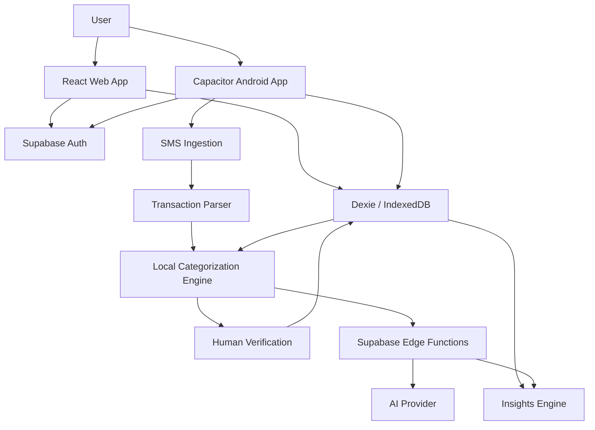
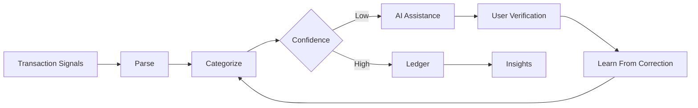

# 📒 KhaataKitab

### ⚡ Agentic AI Ledger for Real-World Finance

<p align="center">
  
  
  
</p>

<p align="center">
  <b>Observe • Understand • Verify • Assist</b><br/>
  Turning raw transaction signals into intelligent financial records
</p>

---

## 🚀 Live App

[Live App](https://khaata-kitab.lovable.app)

> The live deployment is primarily intended for demonstration. Some capabilities — particularly native Android SMS ingestion and cloud synchronization — remain under active development.

---

## 🧠 What Makes KhaataKitab Different?

Most finance apps expect users to **input everything manually**.

KhaataKitab behaves more like an assistant that watches, processes, and verifies — reading signals that already exist (bank SMS, receipts) and turning them into structured, categorized ledger entries, with a human in the loop to confirm or correct.

---

## 🎯 Problem → Insight → Solution

| 🚨 Problem | 💡 Insight | ⚡ Solution |
|---|---|---|
| Scattered payments across apps/cash | Bank SMS already contains the truth | Parse SMS into structured transactions |
| Manual entry is tedious and error-prone | Users forget to log transactions | Auto-capture + review queue |
| Miscategorized spending | Keyword rules alone don't generalize | Multi-tier ML categorization with online learning |
| Numbers without context | Data ≠ insight | Dashboards, cashflow trends, financial health score |

---

## 🏗️ Architecture



---

## 🤖 Agentic Workflow



- **Observe** — capture transaction signals from SMS and receipts
- **Understand** — extract and categorize transaction data
- **Verify** — confidence-based review and human confirmation
- **Assist** — generate summaries and financial insights
- **Learn** — incorporate user corrections into local categorization

---

## ⚙️ Core System Capabilities

### 📲 SMS-Based Transaction Capture
- Regex-based parser extracts amount, direction (credit/debit), payment method, last 4 digits, and reference ID from raw bank SMS text
- Runs entirely client-side — no data leaves the device for parsing
- Native Android auto-read (real-time SMS listener) is in progress; current build supports import of sample SMS for testing the parsing pipeline

### 🧠 Multi-Tier Intelligent Categorization
A cascading pipeline that only escalates cost when it needs to:
1. **User-learned mappings** (IndexedDB) — instant, from your own corrections
2. **Merchant dictionary match** — e.g. "Swiggy" → Food & Dining
3. **On-device Naive Bayes classifier** — probabilistic categorization with confidence scoring, Laplace smoothing, online learning from corrections
4. **AI fallback** (Supabase Edge Function → AI provider) — triggered only when local confidence is low

### ✅ Review & Correction Loop
- Transactions below a confidence threshold are flagged **Needs Review**
- Correcting a category updates the on-device classifier's word-frequency table, improving it over time
- Manual entries are cross-checked against parsed SMS (amount/time/merchant/method) to support verified vs. needs-review status

### 📊 Insight Layer
- Monthly income/expense summaries, category breakdown, cashflow trend charts
- Financial Health Score (0–100) from three weighted factors: income regularity, expense control, consistency
- Cashflow "prediction" is currently a deterministic heuristic (rolling average), not a trained forecasting model — labeled accordingly in-app, because the distinction between a heuristic and a model matters

### 📦 Inventory Tracking
- CRUD for stock items with quantity and computed value
- **Ledger ↔ Inventory integration (in progress):** sales transactions will automatically decrement stock

---

## 📱 UI/UX

- Fully responsive: 1 column (mobile) → 2 (tablet) → 3 (desktop)
- Offline-first: reads and writes continue uninterrupted with no network connection, backed by IndexedDB (Dexie)
- Dark mode, smooth transitions, real-time reactive updates on data change

---

## 🔍 Current Implementation Status

| Capability | Status |
|---|---|
| Local ledger (add/edit/delete, filtering, search) | ✅ |
| Offline persistence | ✅ |
| AI categorization (Naive Bayes + fallback) | ✅ |
| SMS parsing | ✅ |
| AI chat copilot | ✅ |
| Receipt processing (cloud vision) | ✅ |
| Supabase authentication | ✅ |
| Cloud synchronization | 🚧 |
| Native Android SMS auto-capture | 🚧 |
| Inventory ↔ ledger integration | 🚧 |

---

## 🛠️ Tech Stack

<p align="center">
  
</p>

**Frontend:** React · TypeScript · Vite · Tailwind CSS · shadcn/ui
**Data & Persistence:** Dexie · IndexedDB
**Backend:** Supabase · PostgreSQL · Edge Functions
**AI:** AI Edge Functions · local Naive Bayes classifier
**Mobile:** Capacitor · Android
**Visualization:** Recharts

---

## ⚡ Engineering Highlights

- Multi-tier categorization pipeline balancing cost, latency, and accuracy (local-first, cloud fallback only when needed)
- Online-learning classifier that improves from user corrections without a server round-trip
- Offline-first architecture with reactive local persistence
- Structured extraction from unstructured bank SMS text via regex parsing
- Real authentication via Supabase Auth, replacing the earlier local-session prototype

---

## 🚀 Run Locally

```bash
git clone <YOUR_GIT_URL>
cd <PROJECT_NAME>
npm install
npm run dev
```

Environment variables required (see `.env.example`):
```
VITE_SUPABASE_URL=
VITE_SUPABASE_ANON_KEY=
```

---

## 🔮 Roadmap

- 👥 **Contacts / party ledger** ("who owes me, whom do I owe") — the core khata use case, in progress
- ☁️ Genuine cloud sync with conflict resolution
- 📦 Ledger ↔ inventory integration (sales auto-adjust stock)
- 📱 Native Android SMS auto-capture
- 🧪 Automated test coverage (parser, classifier)
- 💳 Credit/trust scoring for repeat customers
- 🌍 Multi-language input (Hindi/Marathi voice and text)

---

## 💬 Philosophy

> The future of apps is not interaction. It's automation with intelligence — and a human who can still check its work.

---

## 📄 License

MIT License
